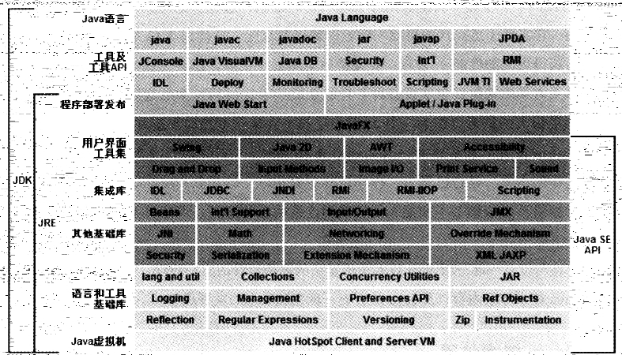
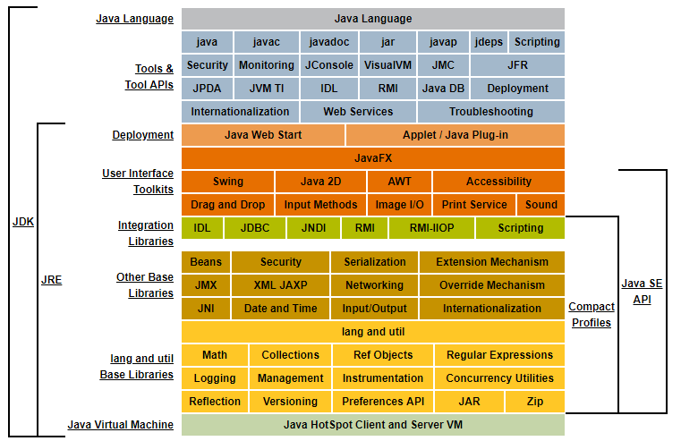
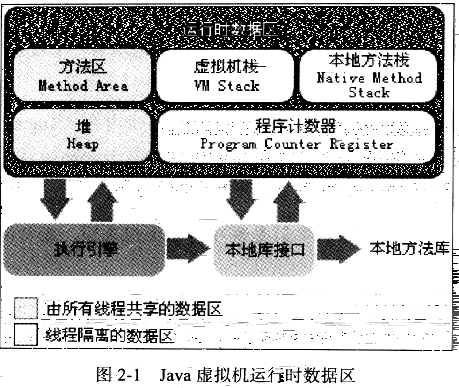

#深入理解Java虚拟机

## 走进Java

###Java技术体系

- java技术体系包含以下几部分：

    - Java程序设计语言
    - 各种硬件平台上的Java虚拟机
    - Class文件格式
    - Java API类库
    - 来自商业机构和开源社区的第三方Java类库
    
    Java程序设计语言，Java虚拟机，Java API类库统称为JDK（java Development Kit），
    JDK是用于支持Java程序开发的最小环境。把Java API类库中的Java SE API子集
    和Java虚拟机这两部分成为JRE，JRE是支持Java程序运行的标准环境。
    
    
    
    
    
## Java内存区域

- 运行时的内存区域

    Java虚拟机在执行Java程序的过程中会把它所管理的内存划分成若干个不同的内存区域。
    这些区域都有个字的用途，以及创建和销毁时间，有的区域随着虚拟机的启动而存在，有的
    区域则依赖用户的线程的启动和结束而建立和销毁。Java虚拟机所管理的内存将会包括
    一下几个数据区域（根据Java SE7）
    
    
    
    - 程序技术器：
    
    程序技术器一块较小的内存空间，它可以看作当前线程所执行的字节码的行号的只是器。在虚拟机的概念里，
    字节码解释器工作就是通过改变这个计数器的值来选取下一条需要执行的字节码指令，分支、循环、跳转、异常处理、线程恢复等基础功能都需要
    依赖这个技术器来完成。
    
    由于Java虚拟机的多线程是通过线程循环切换并分配处理器执行时间的方式来实现的，在任何一个确定的时刻，一个处理器都只会执行一个线程中的指令。
    因此，为了线程切换后能恢复到正确的执行位置，每条线程都需要一个独立的线程计数器。个线程之间的计数器互不影响，独立存储，
    我们称这类内存区域为“线程私有”的内存。
    
    - Java虚拟机栈
    
    Java虚拟机栈也是线程私有的，它的生命周期与线程相同。虚拟机栈描述的是Java方法执行的内存模型：每个方法在执行的同时都会创建一个
    栈帧（Stack Frame）用于存储局部变量表、操作数栈、动态链接、方法出口等信息。每一个方法从调用到执行完成的过程，就对应着一个栈帧在虚拟机栈中入栈到出栈的过程。
    
    经常有人把Java虚拟机分为“堆内存(Heap)”和“栈内存(Stack)”，这种分发比较粗糙，因为程序员最关注的
    与对对象内存分配最密切的内存区域是这两块。其中“栈”就是现在讲的虚拟机栈，或者说虚拟机栈中
    局部变量表部分。
    
    局部变量表存放了编译期可知的各种基本数据类型（int, byte, short, long, double, float, boolean, char ）、
    对象引用（reference类型，它不同于对象本身，可能是一个指向对象起始地址的引用指针）和returnAddress类型（指向一条字节码指令的地址）。
    
    在JVM中，类从被加载到虚拟机中开始，到卸载出内存为止，它的整个生命周期包括：加载、验证、准备、解析、初始化、使用和卸载7个阶段。而解析阶段是虚拟机将常量池内的
    “符号引用”替换为”直接引用“的过程。
    
    1、符号引用（Symbolic References）：符号引用以一组符号来描述所引用的目标，符号可以是任何形式的字面量，只要使用时能够无歧义的定位到目标就行。例如，在Class文件中它以
    CONSTANT_Class_info、CONSTANT_Fieldref_info、CONSTANT_Methodref_info等类型的常量出现。符号引用与虚拟机的内存布局无关，引用的目标并不一定加载到内存中。
    在Java中，一个java类将会编译成一个class文件。在编译时，java类并不知道所引用的类的实际地址，因此只能使用符号引用来代替。比如org.simple.People类引用了org.simple.Language类，
    在编译时People类并不知道Language类的实际内存地址，因此只能使用符号org.simple.Language（假设是这个，当然实际中是由类似于CONSTANT_Class_info的常量来表示的）来表示Language类的地址。
    各种虚拟机实现的内存布局可能有所不同，但是它们能接受的符号引用都是一致的，因为符号引用的字面量形式明确定义在Java虚拟机规范的Class文件格式中。
    
    2、直接引用：
    直接引用可以是
    
    （1）直接指向目标的指针（比如，指向“类型”【Class对象】、类变量、类方法的直接引用可能是指向方法区的指针）
    
    （2）相对偏移量（比如，指向实例变量、实例方法的直接引用都是偏移量）
    
    （3）一个能间接定位到目标的句柄
    
    直接引用是和虚拟机的布局相关的，同一个符号引用在不同的虚拟机实例上翻译出来的直接引用一般不会相同。如果有了直接引用，那引用的目标必定已经被加载入内存中了。
    
    - 本地方法栈
    
    与虚拟机栈所发挥的作用非常相似，它们之间的区别不过是虚拟机栈为虚拟机执行Java方法（也就是字节码）服务，
    而本地方法栈则为虚拟机执行Native方法服务。有的虚拟机（譬如Sun HotSpot虚拟机）直接把本地方法栈和虚拟机栈合二为一。
    
    - Java堆
    
    Java堆是Java虚拟机所管理的内存中最大的一块。Java对是被所有线程共享的一块内存区域，在虚拟机启动是创建。
    此内存区域的唯一目的就是存放对象实例，几乎所有的对象实例以及数组都在这里分配内存。
    Java堆是垃圾收集器主要管理的区域。
    
    - 方法区
    
    方法对和Java堆一样也是各个线程共享的内存区域。它用于存储已被虚拟机加载的类信息、常量和静态变量、即时编译器编译过的代码等数据。
    
    - 运行时常量池
    
    ~是方法区的一部分。Class文件中除了类的版本、字段、方法、接口等描述信息外，还有一项信息是常量池，用于编译器生成各种字面量和方法引用，这部分内容将在类加载后进入
    方法区的运行时常量池中存放。
    
    Java虚拟机对Class文件每一部分（包括常量池）的格式都有 严格的规定， 每一个字节用于存储哪种数据都必须符合规范上的要求才会
    被虚拟机认可、装载和执行。
    
- HotStop虚拟机对象探秘
    
    - 对象的创建
    
    1、虚拟机遇到一条new指令时，首先去检查这个指令的参数是否能在常量池中定位到一个类的符号引用，并且检查这个符号引用代表的类
    是否已被加载、解析以及初始化过。如果没有，则限制性响应的类加载过程。在类加载检查通过后，虚拟机将会为对象分配内存。
    
    2、在类加载通过后，接下来虚拟机将为对象分配内存。为对象分配内存的任务等同于把一块确定大小的内存从Java堆中划分出来（指针碰撞，空闲列表）
    
    3、内存分配完成后，虚拟机需要将分配到的内存空间初始化为零（不包含对象头），如果使用了TLAB，这一工作过程也可以提前至TLAB分配时进行。
    
    4、虚拟机要对兑现进行必要的设置，例如这个对象是那个类的实例、如何才能找到类的元数据信息、对象的哈希、对象的GC分代年龄等信息。
    
    在上面工作都完成之后，从虚拟机的视角来看，一个新的对象已经产生，但从Java程序的视角来看，对象创建才刚刚开始----<init>方法还没执行，所有的字段还为零。
    所以，一般来说，执行new指令之后会接着执行----<init>方法，把所有对象按照程序员的意愿进行初始化，这样一个真正完成可用的对象才完全产生出来。
    
    - 对象的内存布局
    
    对象在内存中的布局可以分为三块区域：对象头(Header)、实例数据(Instance Data)、对齐填充(Padding)。
    
    - 对象的访问定位
    
    句柄
    
    直接指针