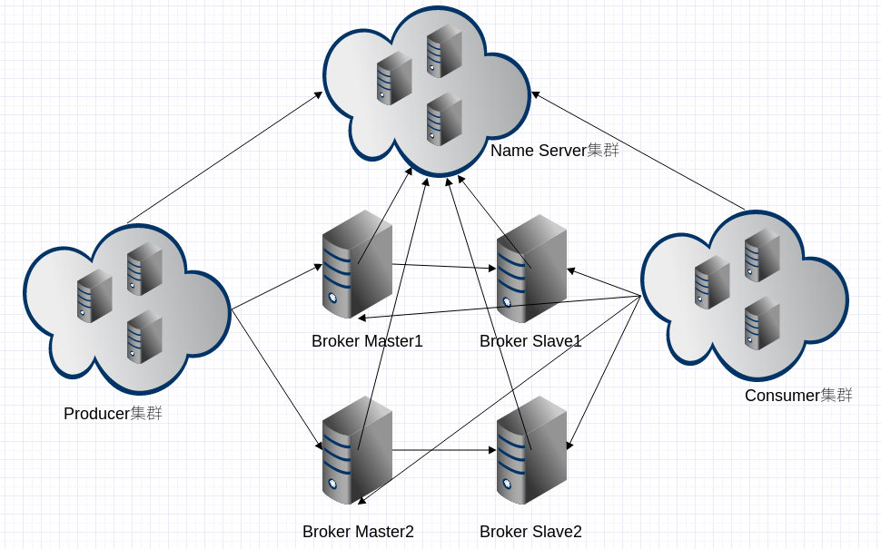
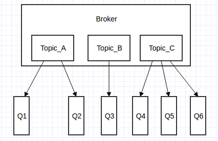

## RocketMQ

### 简介

> RocketMQ 是阿里巴巴在2012年开源的分布式消息中间件，目前已经捐赠给 Apache 软件基金会，
并于2017年9月25日成为 Apache 的顶级项目。作为经历过多次阿里巴巴双十一这种“超级工程”的洗礼并有稳定出色表现的国产中间件，
以其高性能、低延时和高可靠等特性近年来已经也被越来越多的国内企业使用
  
### 特点
  
1. 灵活可拓展
  
    RocketMQ 天然支持集群，其核心四组件（Name Server、Broker、Producer、Consumer）每一个都可以在没有单点故障的情况下进行水平扩展。
  
2. 海量消息堆积能力
  
    RocketMQ 采用零拷贝原理实现超大的消息的堆积能力，据说单机已可以支持亿级消息堆积，而且在堆积了这么多消息后依然保持写入低延迟。
  
3. 支持顺序消息
  
    可以保证消息消费者按照消息发送的顺序对消息进行消费。
    顺序消息分为全局有序和局部有序，一般推荐使用局部有序，即生产者通过将某一类消息按顺序发送至同一个队列来实现。
  
4. 多种消息过滤模式
  
    消息过滤分为在服务器端过滤和在消费端过滤。服务器端过滤时可以按照消息消费者的要求做过滤，优点是减少不必要消息传输，
    缺点是增加了消息服务器的负担，实现相对复杂。消费端过滤则完全由具体应用自定义实现，这种方式更加灵活，缺点是很多无用的消息会传输给消息消费者。
  
5. 支持事务消息
  
    RocketMQ 除了支持普通消息，顺序消息之外还支持事务消息，这个特性对于分布式事务来说提供了又一种解决思路
  
6. 回溯消费
  
    回溯消费是指消费者已经消费成功的消息，由于业务上需求需要重新消费，RocketMQ 支持按照时间回溯消费，时间维度精确到毫秒，可以向前回溯，也可以向后回溯。
  
### 专业术语
  
- Producer
  
  消息生产者，生产者的作用就是将消息发送到 MQ，生产者本身既可以产生消息，如读取文本信息等。
  也可以对外提供接口，由外部应用来调用接口，再由生产者将收到的消息发送到 MQ。
  
- Producer Group
  
  生产者组，简单来说就是多个发送同一类消息的生产者称之为一个生产者组。在这里可以不用关心，只要知道有这么一个概念即可。
  
- Consumer
  
  消息消费者，简单来说，消费 MQ 上的消息的应用程序就是消费者，至于消息是否进行逻辑处理，还是直接存储到数据库等取决于业务需要。
  
- Consumer Group
  
  消费者组，和生产者类似，消费同一类消息的多个 consumer 实例组成一个消费者组。
  
- Topic
  
  Topic 是一种消息的逻辑分类，比如说你有订单类的消息，也有库存类的消息，那么就需要进行分类，一个是订单 Topic 存放订单相关的消息，一个是库存 Topic 存储库存相关的消息。
  
- Message
  
  Message 是消息的载体。一个 Message 必须指定 topic，相当于寄信的地址。Message 还有一个可选的 tag 设置，以便消费端可以基于 tag 进行过滤消息。也可以添加额外的键值对，例如你需要一个业务 key 来查找 broker 上的消息，方便在开发过程中诊断问题。
  
- Tag
  
  标签可以被认为是对 Topic 进一步细化。一般在相同业务模块中通过引入标签来标记不同用途的消息。
  
- Broker
  
  Broker 是 RocketMQ 系统的主要角色，其实就是前面一直说的 MQ。Broker 接收来自生产者的消息，储存以及为消费者拉取消息的请求做好准备。
  
- Name Server
  
  Name Server 为 producer 和 consumer 提供路由信息。
  
### 基本概念
  
> 下面是一张 RocketMQ 的部署结构图，里面涉及了 RocketMQ 核心的四大组件：Name Server、Broker、Producer、Consumer ，
每个组件都可以部署成集群模式进行水平扩展。
  

  
- 生产者
  
  生产者（Producer）负责产生消息，生产者向消息服务器发送由业务应用程序系统生成的消息。 RocketMQ 提供了三种方式发送消息：同步、异步和单向。
  
- 同步发送
        
  同步发送指消息发送方发出数据后会在收到接收方发回响应之后才发下一个数据包。一般用于重要通知消息，例如重要通知邮件、营销短信。
       
- 异步发送
       
  异步发送指发送方发出数据后，不等接收方发回响应，接着发送下个数据包，一般用于可能链路耗时较长而对响应时间敏感的业务场景，
  例如用户视频上传后通知启动转码服务。
       
- 单向发送
       
  单向发送是指只负责发送消息而不等待服务器回应且没有回调函数触发，适用于某些耗时非常短但对可靠性要求并不高的场景，例如日志收集。
   
- 生产者组
   
  生产者组（Producer Group）是一类 Producer 的集合，这类 Producer 通常发送一类消息并且发送逻辑一致，所以将这些 Producer 分组在一起。从部署结构上看生产者通过 Producer Group 的名字来标记自己是一个集群。
   
- 消费者
   
  消费者（Consumer）负责消费消息，消费者从消息服务器拉取信息并将其输入用户应用程序。站在用户应用的角度消费者有两种类型：拉取型消费者、推送型消费者
     
- 拉取型消费者
     
  拉取型消费者（Pull Consumer）主动从消息服务器拉取信息，只要批量拉取到消息，用户应用就会启动消费过程，所以 Pull 称为主动消费型。
     
- 推送型消费者
     
  推送型消费者（Push Consumer）封装了消息的拉取、消费进度和其他的内部维护工作，将消息到达时执行的回调接口留给用户应用程序来实现。
  所以 Push 称为被动消费类型，但从实现上看还是从消息服务器中拉取消息，不同于 Pull 的是 Push 首先要注册消费监听器，当监听器处触发后才开始消费消息。
     
- 消费者组
  
  消费者组（Consumer Group）一类 Consumer 的集合名称，这类 Consumer 通常消费同一类消息并且消费逻辑一致，
  所以将这些 Consumer 分组在一起。消费者组与生产者组类似，都是将相同角色的分组在一起并命名，分组是个很精妙的概念设计，
  RocketMQ 正是通过这种分组机制，实现了天然的消息负载均衡。消费消息时通过 Consumer Group 实现了将消息分发到多个消费者服务器实例，
  比如某个 Topic 有9条消息，其中一个 Consumer Group 有3个实例（3个进程或3台机器），那么每个实例将均摊3条消息，
  这也意味着我们可以很方便的通过加机器来实现水平扩展。
  
- 消息服务器
  
  消息服务器（Broker）是消息存储中心，主要作用是接收来自 Producer 的消息并存储， Consumer 从这里取得消息。
  它还存储与消息相关的元数据，包括用户组、消费进度偏移量、队列信息等。从部署结构图中可以看出 Broker 有 Master 和 Slave 两种类型，
  Master 既可以写又可以读，Slave 不可以写只可以读。
  从物理结构上看 Broker 的集群部署方式有四种：单 Master 、多 Master 、多 Master 多 Slave（同步刷盘）、多 Master多 Slave（异步刷盘）。
   
- 单 Master
   
  这种方式一旦 Broker 重启或宕机会导致整个服务不可用，这种方式风险较大，所以显然不建议线上环境使用。
  
- 多 Master
    
  所有消息服务器都是 Master ，没有 Slave 。这种方式优点是配置简单，单个 Master 宕机或重启维护对应用无影响。
     缺点是单台机器宕机期间，该机器上未被消费的消息在机器恢复之前不可订阅，消息实时性会受影响。
   
- 多 Master 多 Slave（异步复制）
    
  每个 Master 配置一个 Slave，所以有多对 Master-Slave，消息采用异步复制方式，主备之间有毫秒级消息延迟。
  这种方式优点是消息丢失的非常少，且消息实时性不会受影响，Master 宕机后消费者可以继续从 Slave 消费，
  中间的过程对用户应用程序透明，不需要人工干预，性能同多 Master 方式几乎一样。缺点是 Master 宕机时在磁盘损坏情况下会丢失极少量消息。
    
- 多 Master 多 Slave（同步双写）
    
  每个 Master 配置一个 Slave，所以有多对 Master-Slave ，消息采用同步双写方式，主备都写成功才返回成功。
  这种方式优点是数据与服务都没有单点问题，Master 宕机时消息无延迟，服务与数据的可用性非常高。
  缺点是性能相对异步复制方式略低，发送消息的延迟会略高。
    
- 名称服务器
  
  名称服务器（NameServer）用来保存 Broker 相关元信息并给 Producer 和 Consumer 查找 Broker 信息。NameServer 被设计成几乎无状态的，
  可以横向扩展，节点之间相互之间无通信，通过部署多台机器来标记自己是一个伪集群。每个 Broker 在启动的时候会到 NameServer 注册，
  Producer 在发送消息前会根据 Topic 到 NameServer 获取到 Broker 的路由信息，Consumer 也会定时获取 Topic 的路由信息。
  所以从功能上看应该是和 ZooKeeper 差不多，据说 RocketMQ 的早期版本确实是使用的 ZooKeeper ，后来改为了自己实现的 NameServer 。
  
- 消息
  
  消息（Message）就是要传输的信息。一条消息必须有一个主题（Topic），主题可以看做是你的信件要邮寄的地址。一条消息也可以拥有一个可选的标签（Tag）和额处的键值对，它们可以用于设置一个业务 key 并在 Broker 上查找此消息以便在开发期间查找问题。
    
- 主题
    
  主题（Topic）可以看做消息的规类，它是消息的第一级类型。比如一个电商系统可以分为：交易消息、物流消息等，
  一条消息必须有一个 Topic 。Topic 与生产者和消费者的关系非常松散，一个 Topic 可以有0个、1个、多个生产者向其发送消息，
  一个生产者也可以同时向不同的 Topic 发送消息。一个 Topic 也可以被 0个、1个、多个消费者订阅。
    
- 标签
    
  标签（Tag）可以看作子主题，它是消息的第二级类型，用于为用户提供额外的灵活性。
  使用标签，同一业务模块不同目的的消息就可以用相同 Topic 而不同的 Tag 来标识。
  比如交易消息又可以分为：交易创建消息、交易完成消息等，一条消息可以没有 Tag 。
  标签有助于保持您的代码干净和连贯，并且还可以为 RocketMQ 提供的查询系统提供帮助。
    
- 消息队列
  
  消息队列（Message Queue），主题被划分为一个或多个子主题，即消息队列。一个 Topic 下可以设置多个消息队列，
  发送消息时执行该消息的 Topic ，RocketMQ 会轮询该 Topic 下的所有队列将消息发出去。下图 Broker 内部消息情况：
  

  
- 消费者模式
  
  消息消费模式有两种：集群消费（Clustering）和广播消费（Broadcasting）。
  默认情况下就是集群消费，该模式下一个消费者集群共同消费一个主题的多个队列，
  一个队列只会被一个消费者消费，如果某个消费者挂掉，分组内其它消费者会接替挂掉的消费者继续消费。
  而广播消费消息会发给消费者组中的每一个消费者进行消费
  
- 消息顺序
  
  消息顺序（Message Order）有两种：顺序消费（Orderly）和并行消费（Concurrently）。
  顺序消费表示消息消费的顺序同生产者为每个消息队列发送的顺序一致，所以如果正在处理全局顺序是强制性的场景，
  需要确保使用的主题只有一个消息队列。并行消费不再保证消息顺序，消费的最大并行数量受每个消费者客户端指定的线程池限制。
 
 

    
 

  > **整理自网络**
  
  作者：预流
  
  链接：https://juejin.im/post/5af02571f265da0b9e64fcfd
  
  来源：掘金
  
  著作权归作者所有。商业转载请联系作者获得授权，非商业转载请注明出处。