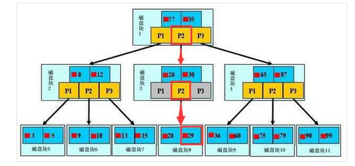

# 面试题

## Java

### 1.Java中的几种基本数据类型是什么，各自占用多少字节。

    类型|大小/字节|类型|封装类|默认值|可表示数据范围
    ---|---|---|---|---|---
    int|4|整型|Integer|0|-2147483648~2147483647
    btye|1|整型|Byte|0|-128~127
    short|2|整型(短整数)|Short|0|-32768~32767
    long|8|整型|Long|0L|-9223372036854775808~9223372036854775807
    boolean|1|逻辑型|Boolean|false|true或false
    float|4|浮点型(单精度)|Float|0.0F|1.4E-45~3.4028235E38
    double|8|浮点型(双精度)|Double|0.0D|4.9E-324~1.7976931348623157E308
    char|2|字符型|Character|空|0~65535

### 2.String类型能被继承吗，为什么？

    不能，String类是用final修饰的

### 3.String，Stringbuffer，Stringbuilder的区别

* String 是不可变的对象，因此每次对String类型进行改变的时候其实就是在生成一个新的String对象，然后将指针指向新的String对象，所以String不适合经常改变内容的字符串。

* StringBuffer则是可变的，每次改变都是对对象本身的操作，不会生成新的对象。在字符串经常变化的情况下推荐使用StringBuffer, StringBuffer支持并发操作，线程安全。

* StringBubuilder与StringBuffer基本相同，区别在于StringBuilder不支持并发操作，线程不安全，性能比较高。

***StringBuffer的扩容过程：***

1. 在使用StringBuffer的append()方法是，会调用父类AbstractStringBuilder的append()方法，在父类的append()方法中，会调用ensureCapacityInternal方法计算容量是否足够。

ensureCapacityInternal方法:

    ```java
    private void ensureCapacityInternal(int minimumCapacity) {
        // overflow-conscious code
        if (minimumCapacity - value.length > 0) {
            value = Arrays.copyOf(value,
                    newCapacity(minimumCapacity));
        }
    }
    ```
newCapacity方法:

    ```java
    private int newCapacity(int minCapacity) {
        // overflow-conscious code
        int newCapacity = (value.length << 1) + 2;
        if (newCapacity - minCapacity < 0) {
            newCapacity = minCapacity;
        }
        return (newCapacity <= 0 || MAX_ARRAY_SIZE - newCapacity < 0)
            ? hugeCapacity(minCapacity)
            : newCapacity;
    }
    ```

### 4.集合

* 为什么出现结合类

  面向对象对事物的提现都是以对象的形式，为了方便对多个对象的操作，就对对象进行存储。集合就是存储对象的最常用的一种方式。


### 5 类的实例化顺序，比如父类静态数据，构造函数，字段，子类静态结构，构造函数，字段，当new的时候，他们的执行顺序

### 6.拿过的Map类，都有什么区别，HashMap是线程安全的吗，并发下使用的Map是什么，他们内部的原理分别是什么，比如存储方式hashcode，扩容，默认容量等。

### 7.Java8的ConcurrentHashMap为什么放弃了分段锁，有什么问题，如何设计？

### 8.有顺序的Map实现类，是怎么实现的，怎么保证有序的

### 9.继承和聚合的区别在哪

### 10.IO模型有哪些，怎么理解NIO，和BIO，AIO的区别是啥，关于reactor模型

### 11.反射的原理，反射创建类实例的三种方式是什么。

### 12.反射中，Class.forName和ClassLoader区别 。

### 13.描述动态代理的几种实现方式，分别说出相应的优缺点。

### 14.动态代理与cglib实现的区别。

### 15.为什么CGlib方式可以对接口实现代理。

### 16.final的用途。

### 17.写出三种单例模式实现 。

### 18.如何在父类中为子类自动完成所有的hashcode和equals实现？这么做有何优劣。

### 19.请结合OO设计理念，谈谈访问修饰符public、private、protected、default在应用设计中的作用。

### 20.==和equals的区别

***==:***

* 可以用于比较基本类型的数据，比较的是基本数据类型的值是否相等。
* 可以比较引用类型的数据，比较的是引用类型的地址是否相等。

***equals:***

* equals只能用于引用类型的比较
* Object提供的equals是用于比较比较对象的引用地址，Object类中的equals方法内部使用的也是‘==’比较，所以与==作用相同
* 自定义类中，可以根据具体的业务逻辑，重写equals方法。可以根据具体的实现方法判断对象是否相等
* 因为String类对equals方法的重写，当使用equals比较两个字符串的时候，比较的是两个字符串的内容。

### 21.overriding和overloading

***overriding:***

* 子父类中出现的同名的方法，就是方法的重写。也就是说重写必须存在继承关心
* 当子类不想原封不动的继承父类中的方法时，可以对方法进行重写
* 若子类中的方法与父类中的某一方法具有相同的方法名、返回类型和参数表，则新方法将覆盖原有的方法。
* 子类函数的访问修饰权限不能少于父类的
* 如需父类中原有的方法，可使用super关键字，该关键字引用了当前类的父类。

___注意事项：___

1. 方法重写方法名和参数列表必须一致
2. 方法重写时子类的权限修饰符必须大于或等于父类的权限修饰符
3. 方法重写时子类的返回值类型必须小于或等于父类的返回值类型
4. 方法重写时子类抛出的异常类型要小于或等于父类的抛出异常的类型

***overloading:***

* 在同一个类中，有多个名称相同，参数不同，参数类型不同的方法。调用方法时通过传递不同的参数来决定具体使用哪个方法。

### 22.sellp()与wait()的区别

* 这两个方法来自不同的类，sleep()方法属于Thread，wait()方法属于Object类.

* sleep()方法属于Thread的静态方法，谁调用谁睡眠，即使在a线程中调用b的sleep方法，实际上睡眠的还是线程a，要让b休眠就要在b的代码中调用sleep方法，可以指定睡眠时间。而wait方法是Object的非静态方法。

* 每个对象都有一个锁来控制同步访问，Synchronized关键字可以和对象的锁交互，来实现同步方法或同步块。sleep()方法正在执行的线程主动让出CPU（然后CPU就可以去执行其他任务），在sleep指定时间后CPU再回到该线程继续往下执行(***注意：sleep方法只释放了CPU资源，而并不会释放同步资源锁***)；wait()方法则是指当前线程让自己暂时退让出同步资源锁（***释放资源释放锁***），以便其他正在等待该资源的线程得到该资源进而运行，只有调用了notify()方法，之前调用wait()的线程才会解除wait状态，可以去参与竞争同步资源锁，进而得到执行。（注意：notify的作用相当于叫醒睡着的人，而并不会给他分配任务，就是说notify只是让之前调用wait的线程有权利重新参与线程的调度）。

* 使用范围：sleep()可以在任何地方使用，而wait()只能在同步方法或同步块中使用.

* 在sleep()睡眠结束之后进入就绪状态，直到获得cpu执行权;wait()

### 多态的理解

* 多态是同一个行为具有多个不同表现形式或形态的能力。多态就是一个接口，使用不同的实例而执行不同的操作。

* 前提： 继承；子类要重写父类的方法；父类的引用指向之类的对象

### 阻塞队列

### mysql索引及查询优化

* 索引类型

1. 主键索引 primary key，它是一种特殊的唯一索引，不允许有空值，一般在建表的同时创建主键索引。

2. 唯一索引 unique， 唯一索引列的值必须唯一，但允许有空值。如果结合索引，则列值的组合必须唯一。可以在创建表的时候指定，也可以修改表结构：ALTER TABLE table_name ADD UNIQUE(column)

3. 普通索引 INDEX 这是最基本的索引，它没有任何限制，可以在创建表的时候指定，也可以修改表结构，ALERT TABLE table_name ADD INDEX index_name(column)

4. 组合索引 INDEX 组合索引包含多个列。可以在创建表的时候指定，也可以修改表结构 ALERT TABLE table_name ADD INDEX index_name(column1, column2, column3)

5. 全文索引 FULLTEXT全文索引（也称全文检索）是目前搜索引擎使用的一种关键技术，它能够利用分词技术等多种算法只能分心出文本中关键字词的频率及重要性，然后按照一定的算法规则之智能的筛选出我们想要的搜索结果。可以在创建表的时候指定，也可以修改表结构，ALERT TABLE table_name ADD FULLTEXT(column)

* 索引结构及原理

  ***B+树***
  

  如上图，是一颗b+树。浅蓝色的块我们称之为一个磁盘块，可以看到每个磁盘块包含几个数据项（深蓝色所示）和指针（黄色所示），如磁盘块1包含数据项17和35，包含指针P1、P2、P3，P1表示小于17的磁盘块，P2表示在17和35之间的磁盘块，P3表示大于35的磁盘块。
  真实的数据存在于叶子节点，即3、5、9、10、13、15、28、29、36、60、75、79、90、99。非叶子节点不存储真实的数据，只存储指引搜索方向的数据项，如17、35并不真实存在于数据表中。

  ***查找过程***
  
  在上图中，如果要查找数据项29，那么首先会把磁盘块1由磁盘加载到内存，此时发生一次IO，在内存中用二分查找确定29在17和35之间，锁定磁盘块1的P2指针，内存时间因为非常短（相比磁盘的IO）可以忽略不计，通过磁盘块1的P2指针的磁盘地址把磁盘块3由磁盘加载到内存，发生第二次IO，29在26和30之间，锁定磁盘块3的P2指针，通过指针加载磁盘块8到内存，发生第三次IO，同时内存中做二分查找找到29，结束查询，总计三次IO。真实的情况是，3层的b+树可以表示上百万的数据，如果上百万的数据查找只需要三次IO，性能提高将是巨大的，如果没有索引，每个数据项都要发生一次IO，那么总共需要百万次的IO，显然成本非常非常高。

  ***性质***

  索引字段要尽量的小。

  索引的最左匹配特性。

  ***创建索引的几大原则***

  最左前缀匹配原则，从左往右以次匹配中间不能跳过。mysql会一直向右匹配直到遇到范围查询(>、<、between、like)就停止匹配。一般在创建多列索引时，where子句中使用最频繁的一列放在最左边。

  尽量选择区分度度高的列作为索引

  =和in可以乱序，比如a = 1 and b = 2 and c = 3，建立(a,b,c)索引可以任意顺序，mysql的查询优化器会帮你优化成索引可以识别的形式。

  索引不能参与计算

  尽量的拓展索引，不要创建索引

  ***索引的不足***

  空间：索引需要占用空间

  时间：查询索引需要时间

  维护：索引需要维护（数据变更时）

  数据量很小的表；空间紧张的时候不要使用索引

  ***常用优化总结***

  有索引但未被使用的情况

  1. like的参数以通配符开通时，尽量避免like的参数以通配符开头，否则数据库引擎会放弃使用索引而进行全表扫描

  2. where条件不符合最左前缀原则时

  3. 使用! =或<>操作符时

  4. 应尽量避免在where子句中对字段进行表达式操作（索引列参与计算），这将导致引擎放弃使用索引而进行全表扫描

  5. 对字段惊醒null值判断，应尽量避免在where字句中对字段进行null值判断，否则将导致引擎放弃使用索引而进行全表扫描。低效：select * from t_credit_detail where Flistid is null ;
  可以在Flistid上设置默认值0，确保表中Flistid列没有null值，然后这样查询：高效：select * from t_credit_detail where Flistid =0;

  6. 应尽量避免在where子句中使用or来连接条件。可以用下面这样的查询代替上面的 or 查询：高效：select from t_credit_detail where Flistid = '2000000608201108010831508721' union all select from t_credit_detail where Flistid = '10000200001';

  避免select *

  order by 语句优化

  1. 重写order by语句以使用索引；

  2. 为所使用的列建立另外一个索引；

  3. 绝对避免在order by子句中使用表达式。

  group by语句优化

  1. 提高GROUP BY 语句的效率, 可以通过将不需要的记录在GROUP BY 之前过滤掉

  用exists代替in

  使用 varchar/nvarchar 代替 char/nchar

  能用DISTINCT的就不用GROUP BY

  能用UNION ALL就不要用UNION

  在Join表的时候使用相当类型的例，并将其索引


深拷贝和浅拷贝区别。
数组和链表数据结构描述，各自的时间复杂度。
error和exception的区别，CheckedException，RuntimeException的区别。
请列出5个运行时异常。
在自己的代码中，如果创建一个java.lang.String类，这个类是否可以被类加载器加
载？为什么。

说一说你对java.lang.Object对象中hashCode和equals方法的理解。在什么场景下需
要重新实现这两个方法。

在jdk1.5中，引入了泛型，泛型的存在是用来解决什么问题。
这样的a.hashcode() 有什么用，与a.equals(b)有什么关系。
有没有可能2个不相等的对象有相同的hashcode。
Java中的HashSet内部是如何工作的。
什么是序列化，怎么序列化，为什么序列化，反序列化会遇到什么问题，如何解决。
java8的新特性。
JVM知识

什么情况下会发生栈内存溢出。
JVM的内存结构，Eden和Survivor比例。
JVM内存为什么要分成新生代，老年代，持久代。新生代中为什么要分为Eden和Survivor。
JVM中一次完整的GC流程是怎样的，对象如何晋升到老年代，说说你知道的几种主要的JVM参
数。

你知道哪几种垃圾收集器，各自的优缺点，重点讲下cms和G1，包括原理，流程，优缺点。
垃圾回收算法的实现原理。
当出现了内存溢出，你怎么排错。
JVM内存模型的相关知识了解多少，比如重排序，内存屏障，happen-before，主内存，工作
内存等。

简单说说你了解的类加载器，可以打破双亲委派么，怎么打破。
讲讲JAVA的反射机制。
你们线上应用的JVM参数有哪些。
g1和cms区别,吞吐量优先和响应优先的垃圾收集器选择。
怎么打出线程栈信息。
请解释如下jvm参数的含义：
-server -Xms512m -Xmx512m -Xss1024K
-XX:PermSize=256m -XX:MaxPermSize=512m -
XX:MaxTenuringThreshold=20XX:CMSInitiatingOccupancyFraction=80 -
XX:+UseCMSInitiatingOccupancyOnly。

简单讲讲tomcat结构，以及其类加载器流程，线程模型等。
tomcat如何调优，涉及哪些参数 。
讲讲Spring加载流程。
Spring AOP的实现原理。
讲讲Spring事务的传播属性。
Spring如何管理事务的。
Spring怎么配置事务（具体说出一些关键的xml 元素）。
说说你对Spring的理解，非单例注入的原理？它的生命周期？循环注入的原理，aop的实现原
理，说说aop中的几个术语，它们是怎么相互工作的。

Springmvc 中DispatcherServlet初始化过程。
netty的线程模型，netty如何基于reactor模型上实现的。
为什么选择netty。
什么是TCP粘包，拆包。解决方式是什么。
netty的fashwheeltimer的用法，实现原理，是否出现过调用不够准时，怎么解决。
netty的心跳处理在弱网下怎么办。
netty的通讯协议是什么样的。
springmvc用到的注解，作用是什么，原理。
springboot启动机制。
点击这里有一套答案版的Spring试题。
操作系统

Linux系统下你关注过哪些内核参数，说说你知道的。
Linux下IO模型有几种，各自的含义是什么。
epoll和poll有什么区别。
平时用到哪些Linux命令。
用一行命令查看文件的最后五行。
用一行命令输出正在运行的java进程。
介绍下你理解的操作系统中线程切换过程。
进程和线程的区别。
top 命令之后有哪些内容，有什么作用。
线上CPU爆高，请问你如何找到问题所在。
多线程

多线程的几种实现方式，什么是线程安全。
volatile的原理，作用，能代替锁么。
画一个线程的生命周期状态图。
sleep和wait的区别。
sleep和sleep(0)的区别。
Lock与Synchronized的区别 。
synchronized的原理是什么，一般用在什么地方(比如加在静态方法和非静态方法的区别，静
态方法和非静态方法同时执行的时候会有影响吗)，解释以下名词：重排序，自旋锁，偏向锁，轻
量级锁，可重入锁，公平锁，非公平锁，乐观锁，悲观锁。

用过哪些原子类，他们的原理是什么。
JUC下研究过哪些并发工具，讲讲原理。
用过线程池吗，如果用过，请说明原理，并说说newCache和newFixed有什么区别，构造函
数的各个参数的含义是什么，比如coreSize，maxsize等。

线程池的关闭方式有几种，各自的区别是什么。
假如有一个第三方接口，有很多个线程去调用获取数据，现在规定每秒钟最多有10个线程同
时调用它，如何做到。

spring的controller是单例还是多例，怎么保证并发的安全。
用三个线程按顺序循环打印abc三个字母，比如abcabcabc。
ThreadLocal用过么，用途是什么，原理是什么，用的时候要注意什么。
如果让你实现一个并发安全的链表，你会怎么做。
有哪些无锁数据结构，他们实现的原理是什么。
讲讲java同步机制的wait和notify。
CAS机制是什么，如何解决ABA问题。
多线程如果线程挂住了怎么办。
countdowlatch和cyclicbarrier的内部原理和用法，以及相互之间的差别(比如
countdownlatch的await方法和是怎么实现的)。

对AbstractQueuedSynchronizer了解多少，讲讲加锁和解锁的流程，独占锁和公平所
加锁有什么不同。

使用synchronized修饰静态方法和非静态方法有什么区别。
简述ConcurrentLinkedQueue和LinkedBlockingQueue的用处和不同之处。
导致线程死锁的原因？怎么解除线程死锁。
非常多个线程（可能是不同机器），相互之间需要等待协调，才能完成某种工作，问怎么设计这种协调方案。
用过读写锁吗，原理是什么，一般在什么场景下用。
开启多个线程，如果保证顺序执行，有哪几种实现方式，或者如何保证多个线程都执行完
再拿到结果。

延迟队列的实现方式，delayQueue和时间轮算法的异同。
点击这里有一套答案版的多线程试题。
TCP与HTTP

http1.0和http1.1有什么区别。
TCP三次握手和四次挥手的流程，为什么断开连接要4次,如果握手只有两次，会出现什么。
TIME_WAIT和CLOSE_WAIT的区别。
说说你知道的几种HTTP响应码，比如200, 302, 404。
当你用浏览器打开一个链接（如：http://www.javastack.cn）的时候，计算机做了哪些工作步骤。
TCP/IP如何保证可靠性，说说TCP头的结构。
如何避免浏览器缓存。
如何理解HTTP协议的无状态性。
简述Http请求get和post的区别以及数据包格式。
HTTP有哪些method
简述HTTP请求的报文格式。
HTTP的长连接是什么意思。
HTTPS的加密方式是什么，讲讲整个加密解密流程。
Http和https的三次握手有什么区别。
什么是分块传送。
Session和cookie的区别。
点击这里有一套答案版的试题。
架构设计与分布式

用java自己实现一个LRU。
分布式集群下如何做到唯一序列号。
设计一个秒杀系统，30分钟没付款就自动关闭交易。
如何使用redis和zookeeper实现分布式锁？有什么区别优缺点，会有什么问题，分别适用什么
场景。（延伸：如果知道redlock，讲讲他的算法实现，争议在哪里）

如果有人恶意创建非法连接，怎么解决。
分布式事务的原理，优缺点，如何使用分布式事务，2pc 3pc 的区别，解决了哪些问题，还有
哪些问题没解决，如何解决，你自己项目里涉及到分布式事务是怎么处理的。

什么是一致性hash。
什么是restful，讲讲你理解的restful。
如何设计一个良好的API。
如何设计建立和保持100w的长连接。
解释什么是MESI协议(缓存一致性)。
说说你知道的几种HASH算法，简单的也可以。
什么是paxos算法， 什么是zab协议。
一个在线文档系统，文档可以被编辑，如何防止多人同时对同
一份文档进行编辑更新。

线上系统突然变得异常缓慢，你如何查找问题。
说说你平时用到的设计模式。
Dubbo的原理，有看过源码么，数据怎么流转的，怎么实现集群，负载均衡，服务注册
和发现，重试转发，快速失败的策略是怎样的 。

一次RPC请求的流程是什么。
自己实现过rpc么，原理可以简单讲讲。Rpc要解决什么问题。
异步模式的用途和意义。
编程中自己都怎么考虑一些设计原则的，比如开闭原则，以及在工作中的应用。
设计一个社交网站中的“私信”功能，要求高并发、可扩展等等。 画一下架构图。
MVC模式，即常见的MVC框架。
聊下曾经参与设计的服务器架构并画图，谈谈遇到的问题，怎么解决的。
应用服务器怎么监控性能，各种方式的区别。
如何设计一套高并发支付方案，架构如何设计。
如何实现负载均衡，有哪些算法可以实现。
Zookeeper的用途，选举的原理是什么。
Zookeeper watch机制原理。
Mybatis的底层实现原理。
请思考一个方案，实现分布式环境下的countDownLatch。
后台系统怎么防止请求重复提交。
描述一个服务从发布到被消费的详细过程。
讲讲你理解的服务治理。
如何做到接口的幂等性。
如何做限流策略，令牌桶和漏斗算法的使用场景。
什么叫数据一致性，你怎么理解数据一致性。
分布式服务调用方，不依赖服务提供方的话，怎么处理服务方挂掉后，大量无效资源请求
的浪费，如果只是服务提供方吞吐不高的时候该怎么做，如果服务挂了，那么一会重启，该怎
么做到最小的资源浪费，流量半开的实现机制是什么。

dubbo的泛化调用怎么实现的，如果是你，你会怎么做。
远程调用会有超时现象，如果做到优雅的控制，JDK自带的超时机制有哪些，怎么实现的。
算法

10亿个数字里里面找最小的10个。
有1亿个数字，其中有2个是重复的，快速找到它，时间和空间要最优。
2亿个随机生成的无序整数,找出中间大小的值。
给一个不知道长度的（可能很大）输入字符串，设计一种方案，将重复的字符排重。
遍历二叉树。
有3n+1个数字，其中3n个中是重复的，只有1个是不重复的，怎么找出来。
写一个字符串（如：www.javastack.cn）反转函数。
常用的排序算法，快排，归并、冒泡。 快排的最优时间复杂度，最差复杂度。冒泡排序的
优化方案。

二分查找的时间复杂度，优势。
一个已经构建好的TreeSet，怎么完成倒排序。
什么是B+树，B-树，列出实际的使用场景。
一个单向链表，删除倒数第N个数据。
200个有序的数组，每个数组里面100个元素，找出top20的元素。
单向链表，查找中间的那个元素。
数据库知识

数据库隔离级别有哪些，各自的含义是什么，MYSQL默认的隔离级别是是什么。
什么是幻读。
MYSQL有哪些存储引擎，各自优缺点。
高并发下，如何做到安全的修改同一行数据。
乐观锁和悲观锁是什么，INNODB的标准行级锁有哪2种，解释其含义。
SQL优化的一般步骤是什么，怎么看执行计划，如何理解其中各个字段的含义。
数据库会死锁吗，举一个死锁的例子，mysql怎么解决死锁。
MYsql的索引原理，索引的类型有哪些，如何创建合理的索引，索引如何优化。
聚集索引和非聚集索引的区别。
select for update 是什么含义，会锁表还是锁行或是其他。
为什么要用Btree实现，它是怎么分裂的，什么时候分裂，为什么是平衡的。
数据库的ACID是什么。
某个表有近千万数据，CRUD比较慢，如何优化。
Mysql怎么优化table scan的。
如何写sql能够有效的使用到复合索引。
mysql中in 和exists 区别。
数据库自增主键可能的问题。
MVCC的含义，如何实现的。
你做过的项目里遇到分库分表了吗，怎么做的，有用到中间件么，比如sharding jdbc等,他
们的原理知道么。

MYSQL的主从延迟怎么解决。
消息队列

消息队列的使用场景。
消息的重发，补充策略。
如何保证消息的有序性。
用过哪些MQ，和其他mq比较有什么优缺点，MQ的连接是线程安全的吗，你们公司的MQ服务
架构怎样的。

MQ系统的数据如何保证不丢失。
rabbitmq如何实现集群高可用。
kafka吞吐量高的原因。
kafka 和其他消息队列的区别，kafka 主从同步怎么实现。
利用mq怎么实现最终一致性。
使用kafka有没有遇到什么问题，怎么解决的。
MQ有可能发生重复消费，如何避免，如何做到幂等。
MQ的消息延迟了怎么处理，消息可以设置过期时间么，过期了你们一般怎么处理。
缓存

常见的缓存策略有哪些，如何做到缓存(比如redis)与DB里的数据一致性，你们项目中用到了
什么缓存系统，如何设计的。

如何防止缓存击穿和雪崩。
缓存数据过期后的更新如何设计。
redis的list结构相关的操作。
Redis的数据结构都有哪些。
Redis的使用要注意什么，讲讲持久化方式，内存设置，集群的应用和优劣势，淘汰策略等。
redis2和redis3的区别，redis3内部通讯机制。
当前redis集群有哪些玩法，各自优缺点，场景。
Memcache的原理，哪些数据适合放在缓存中。
redis和memcached 的内存管理的区别。
Redis的并发竞争问题如何解决，了解Redis事务的CAS操作吗。
Redis的选举算法和流程是怎样的。
redis的持久化的机制，aof和rdb的区别。
redis的集群怎么同步的数据的。
知道哪些redis的优化操作。
Reids的主从复制机制原理。
Redis的线程模型是什么。
请思考一个方案，设计一个可以控制缓存总体大小的自动适应的本地缓存。
如何看待缓存的使用（本地缓存，集中式缓存），简述本地缓存和集中式缓存和优缺点。
本地缓存在并发使用时的注意事项。

搜索

elasticsearch了解多少，说说你们公司es的集群架构，索引数据大小，分片有多少，以及一些
调优手段 。elasticsearch的倒排索引是什么。

elasticsearch 索引数据多了怎么办，如何调优，部署。
elasticsearch是如何实现master选举的。
详细描述一下Elasticsearch索引文档的过程。
详细描述一下Elasticsearch搜索的过程。
Elasticsearch在部署时，对Linux的设置有哪些优化方法？
lucence内部结构是什么。